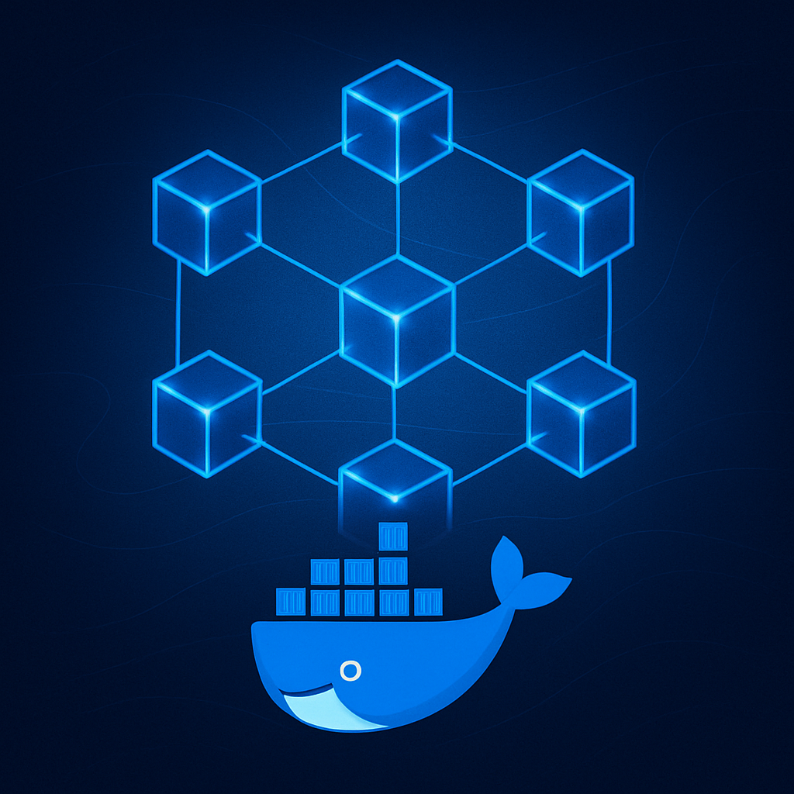

<div align="center">
  
</div>

# Hyperledger Besu Network Manager

Automated management system for private blockchain networks based on Hyperledger Besu with Clique (Proof of Authority) consensus protocol.

This project implements a complete solution for creating and managing private blockchain networks, eliminating manual configuration and resource conflicts through automated Docker container management.

## Technical Description

The system provides a web interface developed in Next.js that allows creating and managing Hyperledger Besu networks automatically. It uses Docker for node containerization and implements dynamic allocation algorithms to avoid port conflicts, IP addresses, and resource naming.

## Tech Stack

- **Frontend**: Next.js 15, React, TypeScript
- **Backend**: Node.js, Dockerode API
- **Blockchain**: Hyperledger Besu
- **Consensus Protocol**: Clique (Proof of Authority)
- **Containerization**: Docker Engine, Docker Networks
- **UI**: Tailwind CSS

## System Requirements

```bash
# Verify minimum versions
node --version    # >= 18.0.0
npm --version     # >= 8.0.0
docker --version  # >= 20.0.0
```

### Docker Configuration

**The project works in multiple environments:**

#### Windows (Recommended)
- **Docker Desktop** running on Windows
- Run the application directly from **PowerShell** or **Command Prompt**
- The dockerode library automatically connects to Docker Desktop

#### WSL2 (Alternative)
- Docker Desktop with WSL2 integration enabled
- Run the application from WSL2 Ubuntu/Debian
- Verify Docker works: `docker ps`

#### Linux/macOS
- Docker Engine installed and running
- Docker socket available at `/var/run/docker.sock`

## Installation

### Environment Setup

```bash
# Clone the repository
git clone https://github.com/rubencrxz/web25-besu-2025.git

# Navigate to project directory
cd web25-besu-2025/web

# Install dependencies (use --legacy-peer-deps if conflicts arise)
npm install --legacy-peer-deps

# Start development server
npm run dev
```

### Installation Verification

1. Access `http://localhost:3000` (or the port shown in the terminal) to verify the application is running
2. Verify Docker connection at `http://localhost:3000/api/networks` (adjust port if different)

## Usage Guide

### Web Interface

#### Network Creation

1. Access the main dashboard
2. Select "New Network"
3. Enter identifying name
4. Confirm creation

The system will automatically assign a unique subnet and generate a conflict-free network name.

#### Node Deployment

1. Select existing network
2. Click "Add Node"
3. Specify node type:
   - **Miner Node**: Validates transactions and produces blocks
   - **RPC Node**: Provides endpoints for external applications
4. Confirm deployment

The application will automatically assign unique RPC ports, internal IP addresses, and container names.

### Script-Based Deployment (WSL Recommended for Windows)

For users who prefer command-line deployment:

```bash
# Navigate to scripts directory
cd script/

# Grant execution permissions (Linux/macOS/WSL)
chmod +x script.sh

# Execute automatic deployment
./script.sh
```

**Note**: The bash script requires a Unix environment (Linux, macOS, WSL). For native Windows, use the web interface.

## Functionality Testing

### Connectivity Verification

```bash
# Check node response (example with port 8545)
curl -X POST \
  -H "Content-Type: application/json" \
  --data '{"jsonrpc":"2.0","method":"eth_blockNumber","params":[],"id":1}' \
  http://localhost:8545
```

## System Architecture

### Resource Management

The system implements the following automatic allocation mechanisms:

- **RPC Ports**: Range 8545-8600, sequential assignment
- **P2P Ports**: Range 30303-30400, dynamic assignment
- **Docker Subnets**: Range 172.20.0.0/16 - 172.50.0.0/16
- **Container Names**: Typological prefix + cryptographic hash

### Consensus Protocol

- **Algorithm**: Clique (Proof of Authority)
- **Block Time**: Approximately 15 seconds
- **Finality**: Deterministic after confirmation
- **Network ID**: Unique per deployed network

## Troubleshooting

### Docker Connection Issues

```bash
# Verify Docker is running
docker ps

# On Windows: Restart Docker Desktop
# On WSL: sudo service docker start
# On Linux/macOS: sudo systemctl start docker
```

### NPM Dependency Conflicts

```bash
# Clean and install with legacy peer deps
rm -rf node_modules package-lock.json
npm install --legacy-peer-deps
```

### Port Conflicts

The system assigns ports automatically, but if conflicts occur:

- Check occupied ports: `netstat -an | findstr :8545` (Windows) or `lsof -i :8545` (Unix)
- The system will automatically skip to available ports
