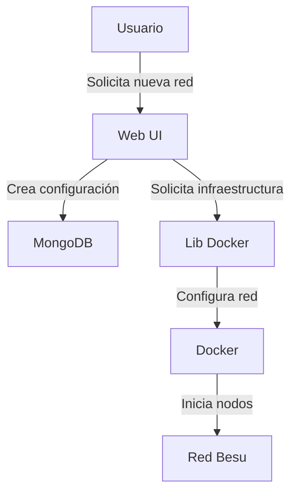
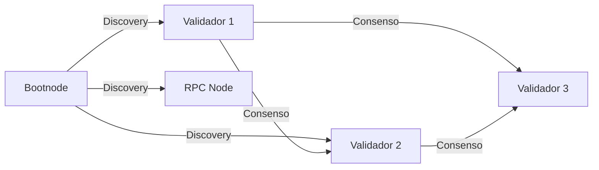

# Sistema de Gestión de Redes Hyperledger Besu

## Introducción a Hyperledger Besu

Hyperledger Besu es un cliente Ethereum empresarial diseñado para ser utilizado en redes públicas y privadas. En este proyecto se implementa una red privada utilizando el consenso Clique (Proof of Authority), que permite una validación rápida y eficiente de transacciones mediante un conjunto de nodos validadores autorizados, ideal para entornos empresariales.

Se proporciona una solución completa para gestionar redes Besu utilizando contenedores Docker, con una interfaz web para la administración y monitoreo de nodos. El sistema permite la gestión de validadores mediante un sistema de propuestas donde los firmantes existentes pueden votar para añadir o eliminar nuevos validadores.

### Componentes de una Red Besu

1. **Nodos Validadores (Mineros)**
   - Participan en el consenso Clique
   - Proponen y validan bloques
   - Mantienen la integridad de la red
   - Requieren claves privadas para firmar bloques

2. **Bootnode**
   - Punto de entrada inicial para nuevos nodos
   - Facilita el descubrimiento P2P
   - Mantiene la lista de nodos activos

3. **Nodos RPC**
   - Proporcionan acceso a la API JSON-RPC
   - Permiten interactuar con la blockchain
   - Procesan transacciones y consultas

4. **Nodos Completos**
   - Almacenan la blockchain completa
   - Sincronizan con otros nodos

## Estructura del Proyecto

### 1. Aplicación Web (`/web`)
Interfaz gráfica desarrollada con Next.js 13 que incluye:

#### Frontend (`/web/app`)
- Implementado en React con TypeScript
- Utiliza el nuevo App Router de Next.js 13
- Interfaz moderna con TailwindCSS
- Gestión visual de redes y nodos Besu

#### Backend (`/web/lib`)
- Implementado en TypeScript
- APIs para gestión de redes y nodos
- Integración con MongoDB para persistencia
- Incluye la librería lib-docker compilada en `lib-besu`

#### Datos de Red (`/web/networks/Keypair`)
- Contine las cuentas de los firmantes
- Almacena pares de claves predefinidos
- Claves públicas y privadas para validadores
- Direcciones Ethereum asociadas
- Necesarios para la inicialización de la red

### 2. Biblioteca Docker (`/lib-docker`)
Librería TypeScript para gestión de infraestructura:
- Creación y gestión de redes Docker
- Gestión del ciclo de vida de nodos Besu
- Configuración automatizada de nodos
- Gestión de contenedores Docker

### 3. Scripts de Utilidad (`/scripts`)
Scripts para la creación de una red Besu de prueba:

#### Scripts de Red
- `script.sh` (Linux) y `script.ps1` (Windows)
- Crean redes Besu de prueba usando Docker
- Generan el directorio `networks` con la configuración

#### Gestión de MongoDB
- `mongodb-docker-setup.sh`: Configura la base de datos en Docker
- `mongodb-compass-connection.md`: Instrucciones de conexión para MongoDB Compass

#### Herramientas Ethereum
- `besu-ethers-toolkit.js`: Utilidades para interactuar con la red Besu
  - Proponer nuevos validadores
  - Listar propuestas pendientes
  - Mostrar validadores actuales
  - Monitorear los nuevos bloques

## Funcionamiento del Sistema

### 1. Creación de Red


### 2. Consenso Clique (PoA)
- Sistema de consenso basado en autoridad donde solo los nodos validadores autorizados pueden firmar bloques
- Proceso de votación para añadir o eliminar validadores (requiere mayoría de votos)
- Los validadores se turnan para crear bloques en un orden predeterminado
- Tiempo de bloque configurable y finalidad rápida
- Ideal para redes privadas con validadores conocidos

### 3. Gestión de Nodos


## Guía de Instalación y Uso

1. **Requisitos Previos**
   ```bash
   # Instalar Docker
   docker --version
   
   # Instalar Node.js
   node --version
   
   # Instalar MongoDB
   ./mongodb-docker-setup.sh
   ```

2. **Configuración del Proyecto**
   ```bash
   # Clonar repositorio
   git clone [URL_REPO]
   
   # Instalar dependencias
   cd web && npm install
   cd ../lib-docker && npm install
   cd ../scripts && npm install
   ```

3. **Iniciar Servicios**
   ```bash
   # Iniciar aplicación web
   cd web
   npm run dev
   ```

4. **Gestión de Firmantes con besu-ethers-toolkit.js**
   ```bash
   # Mostrar los firmantes actuales
   node besu-ethers-toolkit.js list-signers

   # Ver propuestas pendientes
   node besu-ethers-toolkit.js proposals

   # Proponer un nuevo firmante (true para añadir, false para eliminar)
   node besu-ethers-toolkit.js propose <dirección-ethereum> true

   # Monitorear nuevos bloques (útil para verificar cambios)
   node besu-ethers-toolkit.js monitor-blocks
   ```

   El proceso de añadir un nuevo firmante requiere:
   1. Un firmante existente propone al nuevo candidato
   2. Otros firmantes deben votar la propuesta (usando el mismo comando)
   3. Cuando se alcanza la mayoría de votos, el candidato se convierte en firmante
   4. Se puede verificar el estado con `list-signers` y `proposals`

   Ejemplo completo:
   ```bash
   # 1. Ver firmantes actuales
   node besu-ethers-toolkit.js list-signers
   
   # 2. Proponer nuevo firmante
   node besu-ethers-toolkit.js propose 0x1234...5678 true
   
   # 3. Verificar la propuesta
   node besu-ethers-toolkit.js proposals
   
   # 4. Esperar votos de otros firmantes
   node besu-ethers-toolkit.js monitor-blocks
   
   # 5. Confirmar la adición
   node besu-ethers-toolkit.js list-signers
   ```

## API y Endpoints

### REST API
- `POST /api/networks` - Crear red
- `GET /api/networks` - Listar redes
- `DELETE /api/networks/:id` - Eliminar red
- `POST /api/networks/:id/nodes` - Añadir nodo

### JSON-RPC
- `eth_blockNumber` - Último bloque
- `eth_getBalance` - Consultar balance
- `eth_sendTransaction` - Enviar transacción

## Monitoreo y Mantenimiento

1. **Logs de Nodos**
   ```bash
   docker logs [NODE_CONTAINER_ID]
   ```

2. **Métricas**
   - Tiempo de bloque
   - Transacciones por segundo
   - Estado de sincronización
   - Uso de recursos

## Solución de Problemas

1. **Problemas de Consenso**
   - Verificar conectividad entre validadores
   - Comprobar configuración del consenso Clique
   - Verificar el estado de las propuestas de validadores
   - Revisar logs de validadores

2. **Problemas de Red**
   - Verificar puertos Docker
   - Comprobar configuración bootnode
   - Revisar reglas de firewall

## Seguridad

1. **Gestión de Claves**
   - Almacenamiento seguro de claves privadas
   - Rotación de claves
   - Control de acceso

2. **Red**
   - Firewall y reglas de acceso
   - TLS para API RPC
   - Autenticación de nodos

## Referencias

- [Documentación Hyperledger Besu](https://besu.hyperledger.org/en/stable/)
- [Especificación Clique PoA](https://eips.ethereum.org/EIPS/eip-225)
- [Docker Documentation](https://docs.docker.com/)
- [MongoDB Documentation](https://www.mongodb.com/docs/)

## Licencia

[Especificar la licencia del proyecto]
