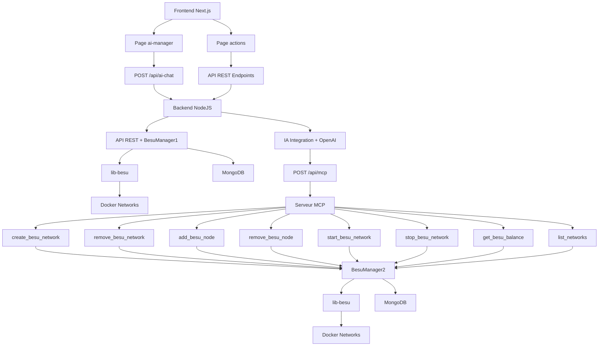
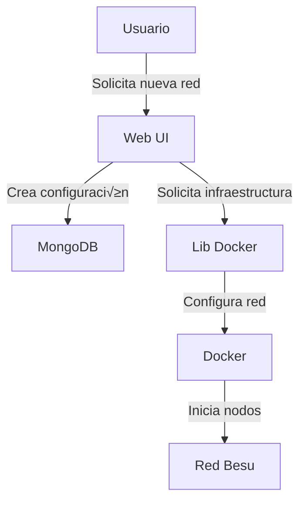
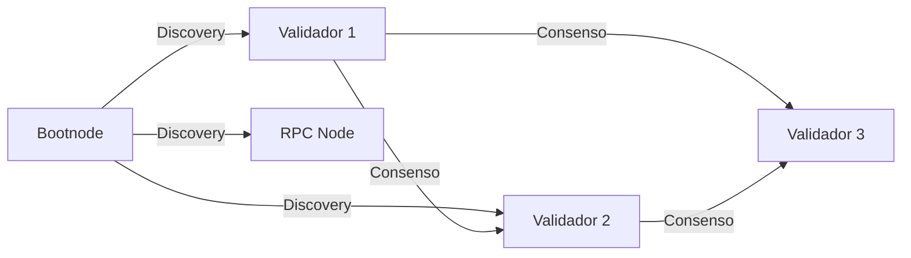

# Sistema de Gestión de Redes Hyperledger Besu

## Introducción a Hyperledger Besu

Hyperledger Besu es un cliente Ethereum empresarial diseñado para ser utilizado en redes públicas y privadas. En este proyecto se implementa una red privada utilizando el consenso Clique (Proof of Authority), que permite una validación rápida y eficiente de transacciones mediante un conjunto de nodos validadores autorizados, ideal para entornos empresariales.

Se proporciona una solución completa para gestionar redes Besu utilizando contenedores Docker, con una interfaz web para la administración y monitoreo de nodos. El sistema permite la gestión de validadores mediante un sistema de propuestas donde los firmantes existentes pueden votar para añadir o eliminar nuevos validadores.

### Componentes de una Red Besu

1. **Nodos Validadores (Mineros)**
   - Participan en el consenso Clique
   - Proponen y validan bloques
   - Mantienen la integridad de la red
   - Requieren claves privadas para firmar bloques

2. **Bootnode**
   - Punto de entrada inicial para nuevos nodos
   - Facilita el descubrimiento P2P
   - Mantiene la lista de nodos activos

3. **Nodos RPC**
   - Proporcionan acceso a la API JSON-RPC
   - Permiten interactuar con la blockchain
   - Procesan transacciones y consultas

4. **Nodos Completos**
   - Almacenan la blockchain completa
   - Sincronizan con otros nodos

## Introducción al Proyecto

### Descripción del funcionamiento de la aplicación 🚀

Esta aplicación web, desarrollada en **Next.js**, permite gestionar redes y nodos Hyperledger Besu de forma visual e intuitiva.

- **Frontend** (`/web/app`):  
  🖥️ Construido con React, TypeScript y TailwindCSS para una interfaz moderna y animaciones fluidas (gracias a framer-motion).

- **Backend** (`/web/lib`):  
  🛠️ Desarrollado en Node.js, expone una API REST que utiliza la librería `lib-besu` para crear y gestionar redes y nodos Besu, conectándose a una base de datos MongoDB.

- **Gestión Inteligente (IA)**:  
  🤖 La página `ai-manager` permite enviar instrucciones en lenguaje natural. El backend utiliza la API de OpenAI para interpretar las órdenes y comunicarse con el servidor MCP, que ejecuta acciones como crear redes, añadir nodos o consultar balances.

- **Servidor MCP**:  
  🔗 Escrito en Node.js, recibe peticiones del backend y ejecuta herramientas como `create_besu_network`, `add_besu_node`, `start_besu_network`, etc., usando la librería `lib-besu` y MongoDB.

En resumen, la aplicación integra gestión visual, automatización inteligente y control seguro de redes Besu, facilitando la administración de blockchains empresariales de forma sencilla y eficiente.

### Escema General


```mermaid
graph TD
    A[Frontend Next.js] --> B[Page ai-manager]
    A --> B2[Page actions]
    B --> C[POST /api/ai-chat]
    B2 --> C2[API REST Endpoints]
    
    C --> D[Backend NodeJS]
    C2 --> D
    D --> E[API REST + BesuManager1]
    D --> F[IA Integration + OpenAI]
    
    E --> G[lib-besu]
    E --> H[MongoDB]
    G --> I[Docker Networks]
    
    F --> J[POST /api/mcp]
    J --> K[Serveur MCP]
    
    K --> P[create_besu_network]
    K --> Q[remove_besu_network]
    K --> R[add_besu_node]
    K --> S[remove_besu_node]
    K --> T[start_besu_network]
    K --> U[stop_besu_network]
    K --> V[get_besu_balance]
    K --> W[list_networks]
    
    P --> L[BesuManager2]
    Q --> L
    R --> L
    S --> L
    T --> L
    U --> L
    V --> L
    W --> L
    
    L --> M[lib-besu]
    L --> N[MongoDB]
    M --> O[Docker Networks]
```

## Estructura del Proyecto

### 1. Aplicación Web (`/web`)
Interfaz gr√°fica desarrollada con Next.js 13 que incluye:

#### Frontend (`/web/app`)
- Implementado en React con TypeScript
- Utiliza el nuevo App Router de Next.js 13
- Interfaz moderna con TailwindCSS
- Gestión visual de redes y nodos Besu

#### Backend (`/web/lib`)
- Implementado en TypeScript
- APIs para gestión de redes y nodos
- Integración con MongoDB para persistencia
- Incluye la librería lib-docker compilada en `lib-besu`

#### Servidor MCP (`/web/mcp-server`)
- Contiene un servidor MCP (Model Context Protocol)
- Implementa el modelo de contexto para la gestión de redes Besu
- Gestiona la creación y la gestión de redes Besu
- Permite la interacción con la IA para automatización de tareas
- Permite gestionar la lógica de negocio con un lenguaje humano 

#### Datos de ejemplo de redes (`/web/data`)
- Contiene un fichero JSON con ejemplos de redes Besu
- Facilita la creación de redes de pruebas en mongoDB

#### Claves y direcciones para nodos (`/web/networks/Keypair`)
- Contine las cuentas usadas para el primer firmante
- Almacena pares de claves predefinidos
- Claves p√∫blicas y privadas para validadores
- Direcciones Ethereum asociadas
- Necesarios para la inicialización de la red

### 2. Biblioteca Docker (`/lib-docker`)
Librería TypeScript para gestión de infraestructura:
- Creación y gestión de redes Docker
- Gestión del ciclo de vida de nodos Besu
- Configuración automatizada de nodos
- Gestión de contenedores Docker

### 3. Scripts de Utilidad (`/scripts`)
Scripts para la creación de una red Besu de prueba:

#### Scripts de Red
- `script.sh` (Linux) y `script.ps1` (Windows)
- Crean redes Besu de prueba usando Docker
- Generan el directorio `networks` con la configuración

#### Gestión de MongoDB
- `mongodb-docker-setup.sh`: Configura la base de datos en Docker
- `mongodb-compass-connection.md`: Instrucciones de conexión para MongoDB Compass


#### Herramientas Ethereum
- `besu-ethers-toolkit.js`: Utilidades para interactuar con la red Besu
  - Proponer nuevos validadores
  - Listar propuestas pendientes
  - Mostrar validadores actuales
  - Monitorear los nuevos bloques

## Funcionamiento del Sistema

### 1. Creación de Red

```mermaid
graph TD
    A[Usuario] -->|Solicita nueva red| B[Web UI]
    B -->|Crea configuración| C[MongoDB]
    B -->|Solicita infraestructura| D[Lib Docker]
    D -->|Configura red| E[Docker]
    E -->|Inicia nodos| F[Red Besu]
```

### 2. Consenso Clique (PoA)
- Sistema de consenso basado en autoridad donde solo los nodos validadores autorizados pueden firmar bloques
- Proceso de votación para añadir o eliminar validadores (requiere mayoría de votos)
- Los validadores se turnan para crear bloques en un orden predeterminado
- Tiempo de bloque configurable y finalidad r√°pida
- Ideal para redes privadas con validadores conocidos

### 3. Gestión de Nodos

```mermaid
graph LR
    A[Bootnode] -->|Discovery| B[Validador 1]
    A -->|Discovery| C[Validador 2]
    A -->|Discovery| D[RPC Node]
    B -->|Consenso| C
    B -->|Consenso| E[Validador 3]
    C -->|Consenso| E
```

## Guía de Instalación y Uso

1. **Requisitos Previos**
   ```bash
   # Instalar Docker
   docker --version
   
   # Instalar Node.js
   node --version
   ```

2. **Configuración del Proyecto**
   ```bash
   # Clonar repositorio
   git clone --branch pfm-2.5-besu https://github.com/codecrypto-academy/CarreteroSamuel.git
   
   # Instalar dependencias
   cd web 
   npm install
   cd mcp-server
   npm install
   cd ../../lib-docker 
   npm install
   cd ../scripts 
   npm install
   cd 
   ```

3. **Compilación y Despliegue de lib-docker**
   
   Cuando se realizan cambios en la librería lib-docker, es necesario recompilarla y actualizar su versión en la aplicación web:
   ```bash
   # Entrar al directorio lib-docker
   cd lib-docker

   # Compilar la librería
   npm run build
   ```
   # Copiar los archivos compilados a la aplicación web y al servidor MCP

   ## En Windows
   ```bash
   xcopy /E /I /Y dist ..\web\src\lib\lib-besu
   xcopy /E /I /Y dist ..\web\mcp-server\dist\lib-besu
   ```

   ## En Linux/Mac
   ```bash
   cp -r dist/* ../web/src/lib/lib-besu/
   cp -r dist/* ../web/mcp-server/dist/lib-besu/
   ```
   
   Este proceso actualiza la librería en la aplicación web con los últimos cambios realizados.

4. **Iniciar Servicios**
   ```bash

   cd scripts
   # Iniciar la base de datos MongoDB (Solo la primera vez)
   ./mongodb-docker-setup.sh

   cd ../web
   # Iniciar servidor MCP
   npm run start:mcp-server

   #-----------Y en otro terminal ------------

   cd web
   # Iniciar aplicación web
   npm run dev
   ```

5. **Gestión de Firmantes con besu-ethers-toolkit.js**

   Los nodos validadores que son creados son firmantes por defecto. Para añadir o eliminar firmantes, se utiliza el script `besu-ethers-toolkit.js` que interactúa con la red Besu a través de JSON-RPC.

   Para configurar el script besu-ethers-toolkit.js, debes crear un archivo `.env` en el directorio scripts y definir las siguientes variables de entorno:
   ```bash
   BESU_RPC=http://localhost:18555 (Puerto del node Besu Firmante)
   PRIVATE_KEY=0x... (clave privada del firmante)
   ```

   BESU_RPC indica la URL del nodo Besu al que se conectar√° el script.
   PRIVATE_KEY es la clave privada de la cuenta que firmar√° las transacciones.
   Asegúrate de mantener este archivo seguro, ya que contiene información sensible.
   
   ```bash
   # Mostrar los firmantes actuales
   node besu-ethers-toolkit.js list-signers

   # Ver propuestas pendientes
   node besu-ethers-toolkit.js proposals

   # Proponer un nuevo firmante (true para añadir, false para eliminar)
   node besu-ethers-toolkit.js propose <dirección-ethereum> true

   # Monitorear nuevos bloques (√∫til para verificar cambios)
   node besu-ethers-toolkit.js monitor-blocks
   ```

   El proceso de añadir un nuevo firmante requiere:
   1. Un firmante existente propone al nuevo candidato
   2. Otros firmantes deben votar la propuesta (usando el mismo comando)
   3. Cuando se alcanza la mayoría de votos, el candidato se convierte en firmante
   4. Se puede verificar el estado con `list-signers` y `proposals`

   Ejemplo completo:
   ```bash
   # 1. Ver firmantes actuales
   node besu-ethers-toolkit.js list-signers
   
   # 2. Proponer nuevo firmante
   node besu-ethers-toolkit.js propose 0x1234...5678 true
   
   # 3. Verificar la propuesta
   node besu-ethers-toolkit.js proposals
   
   # 4. Esperar votos de otros firmantes
   node besu-ethers-toolkit.js monitor-blocks
   
   # 5. Confirmar la adición
   node besu-ethers-toolkit.js list-signers
   ```

## API y Endpoints

### REST API
- `POST /api/networks` - Crear red
- `GET /api/networks` - Listar redes
- `DELETE /api/networks/:id` - Eliminar red
- `POST /api/networks/:id/nodes` - Añadir nodo

### JSON-RPC
- `eth_blockNumber` - √öltimo bloque
- `eth_getBalance` - Consultar balance
- `eth_sendTransaction` - Enviar transacción

## Monitoreo y Mantenimiento

1. **Logs de Nodos**
   ```bash
   docker logs [NODE_CONTAINER_ID]
   ```

2. **Métricas**
   - Tiempo de bloque
   - Transacciones por segundo
   - Estado de sincronización
   - Uso de recursos

## Solución de Problemas

1. **Problemas de Consenso**
   - Verificar conectividad entre validadores
   - Comprobar configuración del consenso Clique
   - Verificar el estado de las propuestas de validadores
   - Revisar logs de validadores

2. **Problemas de Red**
   - Verificar puertos Docker
   - Comprobar configuración bootnode
   - Revisar reglas de firewall

## AI Manager

El sistema incluye un módulo de gestión inteligente (AI Manager) que facilita la interacción y automatización de tareas en la red Besu mediante inteligencia artificial.

### 1. Integración con OpenAI

La IA del sistema utiliza la API de OpenAI para asistir en la gestión de redes, generación de comandos, ayuda contextual y automatización de flujos. Para habilitar esta funcionalidad es necesario disponer de una clave de API de OpenAI.

- **Dónde colocar la clave:**
  Debe crearse un archivo `.env.local` en el directorio `web/` con el siguiente contenido:
  
  ```env
  OPENAI_API_KEY=sk-xxxxxxxxxxxxxxxxxxxxxxxxxxxxxxxxxxxxxxxx
  ```
  Sustituya el valor por su clave personal de OpenAI. Sin esta clave, las funciones de IA no estar√°n disponibles en la interfaz web.

### 2. Servidor MCP (Model Context Protocol)

El servidor MCP es responsable de gestionar la comunicación entre la interfaz web y los servicios de backend, incluyendo la IA y la gestión de redes Besu. Este servidor permite la orquestación de tareas complejas y la integración de la lógica de negocio avanzada.

- **¿Para qué sirve?**
  - Centraliza la lógica de gestión de redes y nodos
  - Expone endpoints para la IA y la administración de la red
  - Permite la creación y gestión de redes Besu desde la web
  - Permite la interacción con MongoDB para persistencia de datos
  - Permite añadir funciones de forma modular y escalable
  - Permite añadir condiciones y reglas complejas de forma sencilla

  **Cómo se compila:**
   - Asegúrese de que la librería `lib-docker` está compilada y actualizada en el directorio `web/mcp-server/dist/lib-besu/`.
   - La librería se compila al ejecutar `npm run build` en el directorio `web/mcp-server`.

- **Cómo se ejecuta:**
  Desde el directorio `web`, utilice el siguiente comando para iniciar el servidor MCP:
  
  ```bash
  npm run start:mcp-server
  ```
  > **Importante:** Debe ejecutar este comando para poder utilizar la pagina AI Manager. Y se debe ejecutar desde el directorio `web` para que los directorios de las redes se creen en la ubicación correcta. Si se ejecuta desde otro directorio, la estructura de carpetas podría no ser la esperada y causar errores en la gestión de redes.

## Mejoras Potenciales

1. **Publicación de lib-docker en NPM**
   - Publicar la librería lib-docker como un paquete npm público
   - Esto permitiría:
     - Instalación directa con `npm install @besu/lib-docker`
     - Gestión de versiones más eficiente
     - Actualizaciones autom√°ticas con `npm update`
     - Eliminación de la necesidad de copiar manualmente los archivos compilados
     - Mejor integración con otros proyectos

## Referencias

- [Documentación Hyperledger Besu](https://besu.hyperledger.org/en/stable/)
- [Especificación Clique PoA](https://eips.ethereum.org/EIPS/eip-225)
- [Ethers.js Documentation](https://docs.ethers.io/v5/)
- [Docker Documentation](https://docs.docker.com/)
- [MongoDB Documentation](https://www.mongodb.com/docs/)
- [Next.js Documentation](https://nextjs.org/docs)
- [OpenAI API Documentation](https://platform.openai.com/docs/api-reference)
- [Model Context Protocol Documentation](https://github.com/openai/model-context-protocol)

## Licencia

Este proyecto est√° licenciado bajo la Licencia MIT - vea el archivo [LICENSE](./LICENSE) para m√°s detalles.

[](https://opensource.org/licenses/MIT)
