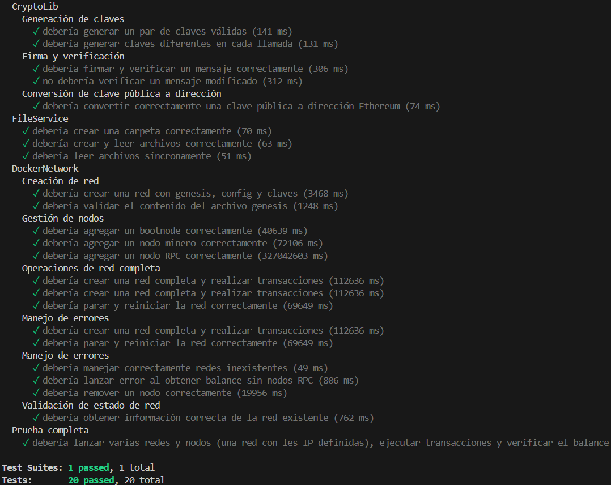

# Biblioteca Docker para Infraestructura Hyperledger Besu

## Descripción Técnica

Esta biblioteca proporciona una capa de abstracción robusta para gestionar la infraestructura de contenedores Docker que ejecutan nodos Hyperledger Besu. Implementa el protocolo IBFT 2.0 y gestiona la configuración completa de redes blockchain privadas.

### Características del Protocolo IBFT 2.0

1. **Consenso Bizantino**
   - Tolerancia a fallos: (n-1)/3 nodos
   - Finalidad inmediata
   - Sin bifurcaciones (forks)
   - Sellado de bloques determinista

2. **Roles de Nodos**
   - Validadores (participan en consenso)
   - Proponentes (proponen bloques)
   - Observadores (no participan en consenso)

3. **Proceso de Consenso**
   ```mermaid
   sequenceDiagram
       Proponente->>Validadores: Propuesta de Bloque
       Validadores->>Validadores: Validación
       Validadores->>Proponente: Pre-commits (2f+1)
       Proponente->>Red: Bloque Sellado
   ```

## Arquitectura del Sistema

### 1. Gestión de Contenedores
```typescript
interface ContainerConfig {
  image: string;          // besu/besu:latest
  network: string;        // Red Docker dedicada
  volumes: string[];      // Montajes para datos y configs
  environment: {          // Variables de entorno
    BESU_NETWORK: string;
    BESU_NODE_PRIVATE_KEY_FILE: string;
    BESU_BOOTNODES: string[];
  };
  ports: {               // Mapeo de puertos
    p2p: number;         // Puerto P2P (default: 30303)
    rpc: number;         // Puerto RPC (default: 8545)
    ws: number;          // Puerto WS (default: 8546)
  };
}
```

```
lib-docker/
├── src/
│   ├── index.ts           # Punto de entrada principal
│   └── __tests__/        # Tests
├── networks/            # Configuraciones de red
│   └── testNetwork1/    # Red de prueba
└── jest.config.js      # Configuración de tests
```

## Uso

### Crear una Red

```typescript
import { createBesuNetwork } from './index';

const network = await createBesuNetwork({
  name: "mi-red",
  chainId: 1337,
  nodes: [
    { type: "bootnode", ip: "10.0.0.10" },
    { type: "miner", ip: "10.0.0.11" },
    { type: "rpc", ip: "10.0.0.12" }
  ]
});
```

### Gestionar Nodos

```typescript
// Añadir nodo
await addNode("mi-red", {
  type: "miner",
  ip: "10.0.0.13"
});

// Eliminar nodo
await removeNode("mi-red", "miner2");
```

### Iniciar/Detener Red

```typescript
// Iniciar red
await startNetwork("mi-red");

// Detener red
await stopNetwork("mi-red");
```

## Configuración de Red

### Estructura de Archivos

```
networks/
└── mi-red/
    ├── config.toml     # Configuración Besu
    ├── genesis.json    # Bloque génesis
    └── nodos (bootnode / miner / rpc / fullnode)
      ├── data (base de datos de la blockchain)
      ├── address
      ├── key
      ├── publicKey
      └── enode (si es bootnode)
```

### Ejemplo de config.toml

```toml
network="mi-red"
p2p-port=30303
rpc-http-enabled=true
rpc-http-api=["ETH","NET","IBFT"]
```

### Ejemplo de genesis.json

```json
{
  "config": {
    "chainId": 1337,
    "ibft2": {
      "blockperiodseconds": 2,
      "epochlength": 30000,
      "requesttimeoutseconds": 4
    }
  }
}
```

## Tests

Ejecutar los tests:
```bash
npm test
```

## API

### Redes

```typescript
createBesuNetwork(config: NetworkConfig): Promise<Network>
removeBesuNetwork(name: string): Promise<void>
startBesuNetwork(name: string): Promise<void>
stopBesuNetwork(name: string): Promise<void>
```

### Nodos

```typescript
addBesuNode(network: string, config: NodeConfig): Promise<Node>
removeBesuNode(network: string, nodeName: string): Promise<void>
getNodeStatus(network: string, nodeName: string): Promise<NodeStatus>
```

### Utilidades

```typescript
getNetworkLogs(name: string): Promise<string[]>
getNodeMetrics(network: string, node: string): Promise<Metrics>
```

## Solución de Problemas

### Problemas Comunes

1. Error al crear contenedores:
   - Verificar permisos de Docker
   - Comprobar puertos disponibles

2. Error de conexión entre nodos:
   - Verificar configuración de red
   - Comprobar puertos P2P

3. Error al iniciar nodos:
   - Verificar archivos de configuración
   - Comprobar logs de Docker

## Contribución

1. Fork del repositorio
2. Crear rama de característica
3. Commit de cambios
4. Push a la rama
5. Crear Pull Request

## Tests Unitarios

La biblioteca incluye una suite completa de tests unitarios para verificar su funcionamiento correcto. Los tests están implementados utilizando Jest, el framework de testing de NodeJS.

### Script de Prueba

El archivo principal de tests `CryptoLib.test.ts` se encuentra en la carpeta `__tests__`. Este script verifica el funcionamiento correcto de la librería y es especialmente útil cuando se realizan modificaciones para asegurar que todo sigue funcionando como se espera.

### Ejecución de Tests

Para ejecutar los tests, use el siguiente comando en la terminal:

```bash
npm test
```

También puede ejecutar los tests en modo watch (útil durante el desarrollo) con:

```bash
npm run test:watch
```

O generar un informe de cobertura de código con:

```bash
npm run test:coverage
```

### Prueba efectuada con éxito
Si todos las pruebas pasan, estaran en verde :



### Modificación en la librería

Si realiza cambios en la librería, asegúrese de:
1. Actualizar los tests correspondientes en `CryptoLib.test.ts`
2. Ejecutar la suite completa de tests antes de confirmar los cambios
3. Verificar que la cobertura de código se mantiene en niveles aceptables
